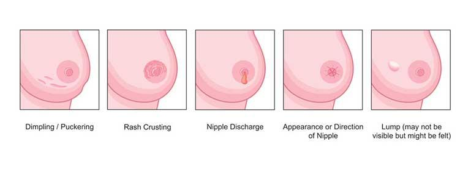
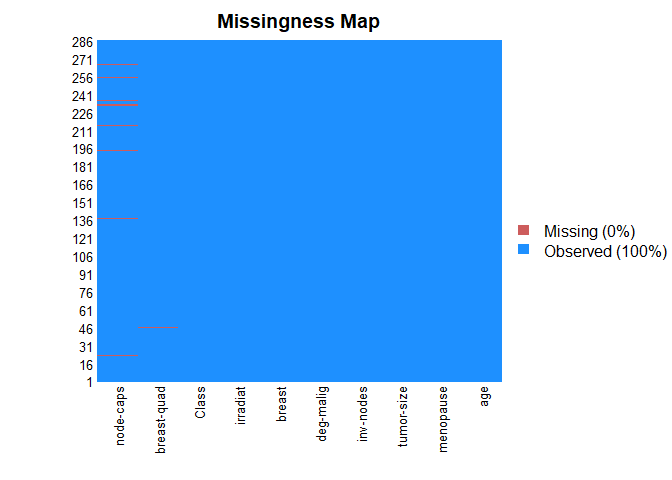
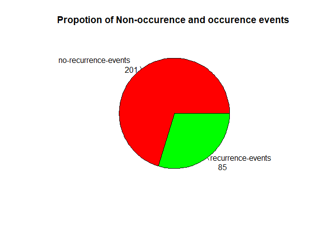
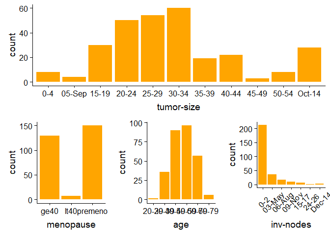
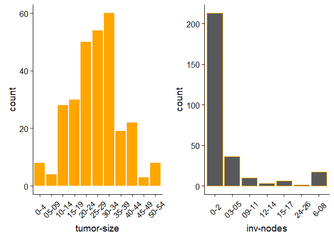
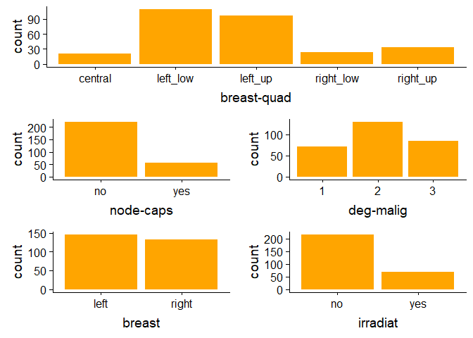
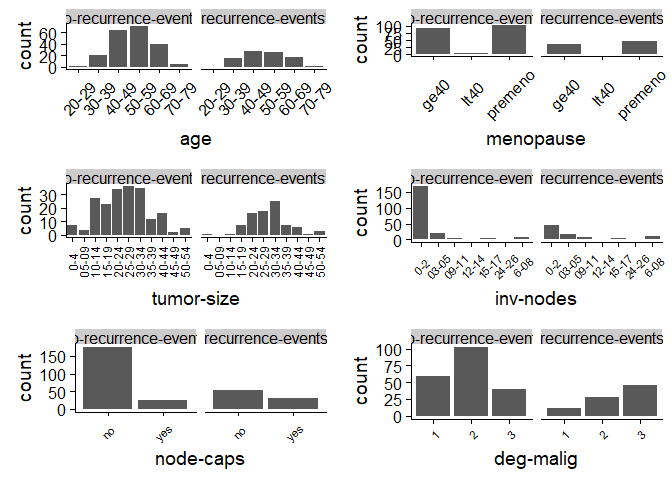
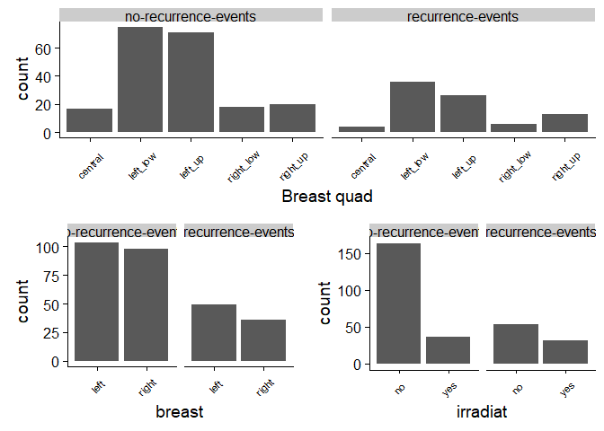

SUPPORT VECTOR MACHINE-Application in R
================

<a id="top"></a>

# Introduction to the project.

This is Support Vector Machine implimentation with R language.It follow
my previous post on [Understanding Support vector machines from
scratch]() so incase you are not farmiliar with what SVMS are please
check my post using that link.The project features exploratory data
analysis steps i have taken to understand the data better before fitting
the model,model evaluation and hyperparameter tuning.

The project main objective is to classify breast cancer cells into a non
recurrent event or recurrent.

## Contents.

1.  [Business value of this project.](#1)

2.  [About the data](#2)

3.  [Loading the necessary libraries for data manipulation.](#3)

4.  <a name="name_of_target">[Data Ingestion.](#4)

5.  <a name="name_of_target">[Exploratory Data Analysis.](#5)

6.  <a name="name_of_target">[Bivariate analysis.](#6)

7.  <a name="name_of_target">[Setting up the data for analysis.](#7)

8.  <a name="name_of_target">[Fitting the model.](#10)

9.  <a name="name_of_target">[Hyper parameter tuning.](#11)

10. <a name="name_of_target">[Finnaly.](#12)

<a id="1"></a>

## </a>Business value of this project.

<center>



</center>

Breast cancer is a type of cancer that develops from breast tissue.Signs
of breast cancer may include a lump in the breast, a change in breast
shape, dimpling of the skin, fluid coming from the nipple, a newly
inverted nipple, or a red or scaly patch of skin.Detection of breast
cancer in its early stages is crucial.Sometimes cancer can be detected
after treatment.This is called **cancer recurrence**.It is not possible
to predict how likely a cancer is to recur.

**Objective:** Predict the likelyhood cancer relapse on a patient.

<a id="2"></a>

[Back to top.](#top)

## About the data.

This breast cancer domain was obtained from the University Medical
Centre, Institute of Oncology, Ljubljana, Yugoslavia.This data set
includes 201 instances of one class and 85 instances of another class.
The instances are described by 9 attributes, some of which are linear
and some are nominal.

The breast cancer dataset can be accessed easily form the DATA HUB
Machine learning repository by [this
link](https://datahub.io/machine-learning/breast-cancer).

Attribute Information:

1.  Class: no-recurrence-events, recurrence-events

2.  age: 10-19, 20-29, 30-39, 40-49, 50-59, 60-69, 70-79, 80-89, 90-99.

3.  menopause: lt40, ge40, premeno.

4.  tumor-size: 0-4, 5-9, 10-14, 15-19, 20-24, 25-29, 30-34, 35-39,
    40-44, 45-49, 50-54, 55-59.

5.  inv-nodes: 0-2, 3-5, 6-8, 9-11, 12-14, 15-17, 18-20, 21-23, 24-26,
    27-29, 30-32, 33-35, 36-39.

6.  node-caps: yes, no.

7.  deg-malig: 1, 2, 3.

8.  breast: left, right.

9.  breast-quad: left-up, left-low, right-up, right-low, central.

<a id="3"></a>

[Back to top.](#top)

## Loading the necessary libraries for data manipulation.

``` r
library(tidyverse)
```

    ## -- Attaching packages ---------------------------------------------------------- tidyverse 1.2.1 --

    ## v ggplot2 3.0.0     v purrr   0.2.5
    ## v tibble  1.4.2     v dplyr   0.7.6
    ## v tidyr   0.8.1     v stringr 1.3.1
    ## v readr   1.1.1     v forcats 0.3.0

    ## -- Conflicts ------------------------------------------------------------- tidyverse_conflicts() --
    ## x dplyr::filter() masks stats::filter()
    ## x dplyr::lag()    masks stats::lag()

``` r
library(ggplot2)
```

<a id="4"></a>

## Data Ingestion.

In this section i will load the data into my r working space.The data is
a csv file separated with semicolons

``` r
library(readr)
cancerdf <- read_csv("breast-cancer_csv.csv")
```

    ## Parsed with column specification:
    ## cols(
    ##   age = col_character(),
    ##   menopause = col_character(),
    ##   `tumor-size` = col_character(),
    ##   `inv-nodes` = col_character(),
    ##   `node-caps` = col_character(),
    ##   `deg-malig` = col_integer(),
    ##   breast = col_character(),
    ##   `breast-quad` = col_character(),
    ##   irradiat = col_character(),
    ##   Class = col_character()
    ## )

``` r
cancerdf2 <- read_csv("breast-cancer_csv.csv")
```

    ## Parsed with column specification:
    ## cols(
    ##   age = col_character(),
    ##   menopause = col_character(),
    ##   `tumor-size` = col_character(),
    ##   `inv-nodes` = col_character(),
    ##   `node-caps` = col_character(),
    ##   `deg-malig` = col_integer(),
    ##   breast = col_character(),
    ##   `breast-quad` = col_character(),
    ##   irradiat = col_character(),
    ##   Class = col_character()
    ## )

### Quick exploration into what the data is made up of.

Before starting any analytical process it is advisable to have a
clearview into the data one is working on interms of
structure,shape,dimensions and posibility of missing values.

Lets take a look.

1.  **Features and observations**

<!-- end list -->

``` r
cancerdf %>% dim()
```

    ## [1] 286  10

The data has a total of 10 features and 286 observations.

2.  **Data Structure**

<!-- end list -->

``` r
cancerdf %>% glimpse()
```

    ## Observations: 286
    ## Variables: 10
    ## $ age           <chr> "40-49", "50-59", "50-59", "40-49", "40-49", "50...
    ## $ menopause     <chr> "premeno", "ge40", "ge40", "premeno", "premeno",...
    ## $ `tumor-size`  <chr> "15-19", "15-19", "35-39", "35-39", "30-34", "25...
    ## $ `inv-nodes`   <chr> "0-2", "0-2", "0-2", "0-2", "03-May", "03-May", ...
    ## $ `node-caps`   <chr> "yes", "no", "no", "yes", "yes", "no", "no", "no...
    ## $ `deg-malig`   <int> 3, 1, 2, 3, 2, 2, 3, 2, 2, 2, 2, 2, 1, 2, 2, 3, ...
    ## $ breast        <chr> "right", "right", "left", "right", "left", "righ...
    ## $ `breast-quad` <chr> "left_up", "central", "left_low", "left_low", "r...
    ## $ irradiat      <chr> "no", "no", "no", "yes", "no", "yes", "no", "no"...
    ## $ Class         <chr> "recurrence-events", "no-recurrence-events", "re...

Most breast cancer dataset features are stored as factor values.For
modeling the data will be transformed later in order to meet the
required standards for the model to work with.This will be done through
one hot encoding.

3.  **Variable Names**

Variable names are very important becuse we will refer to them in the
course of analysis.

``` r
names(cancerdf)
```

    ##  [1] "age"         "menopause"   "tumor-size"  "inv-nodes"   "node-caps"  
    ##  [6] "deg-malig"   "breast"      "breast-quad" "irradiat"    "Class"

In the abouve output,the class variable is the response variable.

4.  **Missing values**

Prescence of missing values in a piece data affects ways in which we
handle it so lets take a look and see.

``` r
table(is.na(cancerdf))
```

    ## 
    ## FALSE  TRUE 
    ##  2851     9

The data has 9 missing values.Visualization can help in identification
of their location.

6.  **Visualizing Missing values.**

<!-- end list -->

``` r
library(Amelia)
```

    ## Loading required package: Rcpp

    ## ## 
    ## ## Amelia II: Multiple Imputation
    ## ## (Version 1.7.5, built: 2018-05-07)
    ## ## Copyright (C) 2005-2019 James Honaker, Gary King and Matthew Blackwell
    ## ## Refer to http://gking.harvard.edu/amelia/ for more information
    ## ##

``` r
missmap(cancerdf)
```

    ## Warning in if (class(obj) == "amelia") {: the condition has length > 1 and
    ## only the first element will be used

    ## Warning: Unknown or uninitialised column: 'arguments'.
    
    ## Warning: Unknown or uninitialised column: 'arguments'.

    ## Warning: Unknown or uninitialised column: 'imputations'.

<!-- -->

This graph shows that the data has missing values in the “node-caps” and
“breast-quad” features.The missing information however take a small
percentage of the whole dataset. 5. **First Five observations**

``` r
head(cancerdf)
```

    ## # A tibble: 6 x 10
    ##   age   menopause `tumor-size` `inv-nodes` `node-caps` `deg-malig` breast
    ##   <chr> <chr>     <chr>        <chr>       <chr>             <int> <chr> 
    ## 1 40-49 premeno   15-19        0-2         yes                   3 right 
    ## 2 50-59 ge40      15-19        0-2         no                    1 right 
    ## 3 50-59 ge40      35-39        0-2         no                    2 left  
    ## 4 40-49 premeno   35-39        0-2         yes                   3 right 
    ## 5 40-49 premeno   30-34        03-May      yes                   2 left  
    ## 6 50-59 premeno   25-29        03-May      no                    2 right 
    ## # ... with 3 more variables: `breast-quad` <chr>, irradiat <chr>,
    ## #   Class <chr>

<a id="5"></a>

## Exploratory Data Analysis.

A good exploratory data analysis gives clear view of the data.

### Summary statistics.

Lets explore the summary statistics of the explanatory variables.

``` r
summary(cancerdf)
```

    ##      age             menopause          tumor-size       
    ##  Length:286         Length:286         Length:286        
    ##  Class :character   Class :character   Class :character  
    ##  Mode  :character   Mode  :character   Mode  :character  
    ##                                                          
    ##                                                          
    ##                                                          
    ##   inv-nodes          node-caps           deg-malig        breast         
    ##  Length:286         Length:286         Min.   :1.000   Length:286        
    ##  Class :character   Class :character   1st Qu.:2.000   Class :character  
    ##  Mode  :character   Mode  :character   Median :2.000   Mode  :character  
    ##                                        Mean   :2.049                     
    ##                                        3rd Qu.:3.000                     
    ##                                        Max.   :3.000                     
    ##  breast-quad          irradiat            Class          
    ##  Length:286         Length:286         Length:286        
    ##  Class :character   Class :character   Class :character  
    ##  Mode  :character   Mode  :character   Mode  :character  
    ##                                                          
    ##                                                          
    ## 

We can see from the summary that the data is not readily usable by the
model.One hot encoding is needed. [Back to top.](#top)

### Univariate Analysis.

#### Categorical variables.

##### Response variable.

Lets see the distribution of the response variable.

``` r
mytable = table(cancerdf$Class)
pie(mytable,labels = paste(names(mytable), "\n", mytable, sep="    "),col = c("red","green"),main = "Propotion of Non-occurence and occurence events ")
```

<!-- -->

We can see that cancer replase is less comared to non relapse.

##### Explanatory variables

This section features the distribution of the eplanatory variables
variables.

``` r
library(ggplot2)
library(cowplot)
```

    ## 
    ## Attaching package: 'cowplot'

    ## The following object is masked from 'package:ggplot2':
    ## 
    ##     ggsave

``` r
p1 = ggplot(cancerdf,aes(age)) + geom_bar(fill = "orange")
p2 = ggplot(cancerdf,aes(menopause)) + geom_bar(fill = "orange")
p3 = ggplot(cancerdf,aes(`tumor-size`)) + geom_bar(fill = "orange")
p3.1 = ggplot(cancerdf,aes(`inv-nodes`)) + geom_bar(fill = "orange")+theme(axis.text.x  = element_text(angle = 45,vjust = .6))
p2_p3 = plot_grid(p2,p1,p3.1,nrow = 1)
plot_grid(p3,p2_p3,nrow = 2)
```

<!-- -->

Looking at the tumor size and inc nodes column,we can see that there are
same labels that wrongly labeled.This can be caused by the spreadsheet
programming used for data entry.

**Tumor size labels correction**

``` r
#to view original tumor size categories
table(cancerdf$`tumor-size`)
```

    ## 
    ##    0-4 05-Sep  15-19  20-24  25-29  30-34  35-39  40-44  45-49  50-54 
    ##      8      4     30     50     54     60     19     22      3      8 
    ## Oct-14 
    ##     28

``` r
# to replace the values
cancerdf$`tumor-size`[cancerdf$`tumor-size` == "05-Sep"] = "05-09"
cancerdf$`tumor-size`[cancerdf$`tumor-size` == "Oct-14"] = "10-14"
# and now to visualize again
 pp1 = ggplot(cancerdf,aes(`tumor-size`)) + geom_bar(fill = "orange")+theme(axis.text.x = element_text(angle = 45,vjust = .5))
```

**inv-nodes correction**

``` r
#to view original tumor size categories
table(cancerdf$`inv-nodes`)
```

    ## 
    ##    0-2 03-May 06-Aug 09-Nov  15-17  24-26 Dec-14 
    ##    213     36     17     10      6      1      3

``` r
# to replace the values
cancerdf$`inv-nodes`[cancerdf$`inv-nodes` == "03-May"] = "03-05"
cancerdf$`inv-nodes`[cancerdf$`inv-nodes` == "06-Aug"] = "6-08"
cancerdf$`inv-nodes`[cancerdf$`inv-nodes` == "09-Nov"] = "09-11"
cancerdf$`inv-nodes`[cancerdf$`inv-nodes` == "Dec-14"] = "12-14"

# and now to visualize again

pp2 = ggplot(cancerdf,aes(`inv-nodes`)) + geom_bar(color = "orange")+theme(axis.text.x = element_text(angle = 45,vjust = .5))

plot_grid(pp1,pp2,nrow = 1)
```

<!-- -->

**Other variables**

``` r
p4 = ggplot(data = cancerdf %>% filter(`node-caps`!="NA"),aes(`node-caps`)) + geom_bar(fill = "orange")
p5 = ggplot(data = cancerdf,aes(`deg-malig`)) + geom_bar(fill = "orange")
p6 = ggplot(data = cancerdf %>% filter(`node-caps`!="NA"),aes(breast)) + geom_bar(fill = "orange")
p7 = ggplot(data = cancerdf%>% filter(`breast-quad`!="NA"),aes(`breast-quad`)) + geom_bar(fill = "orange")
p8 = ggplot(data = cancerdf%>% filter(`breast-quad`!="NA"),aes(irradiat)) + geom_bar(fill = "orange")
plts = plot_grid(p4,p5,p6,p8,ncol = 2,nrow = 2)
plot_grid(p7,plts,nrow = 2,rel_heights = c(5,10))
```

<!-- -->

### Dealling with Missing Values.

THere were missing values in the data so i wu=ill replace them with the
modal values from the data set.

1.  **node-caps**

<!-- end list -->

``` r
getmode <- function(v) {
   uniqv <- unique(v)
   uniqv[which.max(tabulate(match(v, uniqv)))]
}


mode1 = getmode(cancerdf$`node-caps`[!is.na(cancerdf$`node-caps`)])
cancerdf$`node-caps`[is.na(cancerdf$`node-caps`)] = mode1
mode2 = getmode(cancerdf$`breast-quad`[!is.na(cancerdf$`breast-quad`)])
cancerdf$`breast-quad`[is.na(cancerdf$`breast-quad`)] = mode2

table(is.na(cancerdf))
```

    ## 
    ## FALSE 
    ##  2860

<a id="6"></a>

[Back to top.](#top)

## Bivariate analysis.

At this point i will investigate the relationship between explanatory
variables and response variable.

``` r
p9 = ggplot(cancerdf,aes(age))+geom_bar()+facet_wrap(~Class)+theme(axis.text.x = element_text(angle = 45,vjust = .5))
p10 = ggplot(cancerdf,aes(menopause))+geom_bar()+facet_wrap(~Class)+theme(axis.text.x = element_text(angle = 45,vjust = .5))
p11 = ggplot(cancerdf,aes(`tumor-size`))+geom_bar()+theme(axis.text.x = element_text(angle = 90,vjust = .45,size = 9))+facet_wrap(~Class)
p12 = ggplot(cancerdf,aes(`inv-nodes`))+geom_bar()+theme(axis.text.x = element_text(angle = 45,vjust = .45,size = 8))+facet_wrap(~Class)
p13 = ggplot(cancerdf,aes(`node-caps`))+geom_bar()+theme(axis.text.x = element_text(angle = 45,vjust = .45,size = 8))+facet_wrap(~Class)
p14 = ggplot(cancerdf,aes(`deg-malig`))+geom_bar()+theme(axis.text.x = element_text(angle = 45,vjust = .45,size = 8))+facet_wrap(~Class)

row1 = plot_grid(p9,p10)
row2 = plot_grid(p11,p12)
row3 = plot_grid(p13,p14)
plot_grid(row1,row2,row3,nrow = 3,rel_heights =c(3,3,3))
```

<!-- -->

**Observation and Inference**

  - It is visible that women in their late 40s are les likely to suffer
    from both recurrence and non recurence events.

  - Recurence events increase by the degree of malignancy as compared to
    non recurent events which are high at degree two but reduces
    significantly at degree three.

  - Both events chances reduce with increase of inv-nodes.

**Other Variables.**

Looking at other variables we find,

``` r
p15 = ggplot(cancerdf,aes(breast))+geom_bar()+theme(axis.text.x = element_text(angle = 45,vjust = .45,size = 8))+facet_wrap(~Class)
p17 = ggplot(cancerdf,aes(`breast-quad`))+geom_bar()+theme(axis.text.x = element_text(angle = 45,vjust = .45,size = 8))+facet_wrap(~Class)+labs(x='Breast quad')
p18 = ggplot(cancerdf,aes(irradiat))+geom_bar()+theme(axis.text.x = element_text(angle = 45,vjust = .45,size = 8))+facet_wrap(~Class)
plot_grid(p17,plot_grid(p15,p18),nrow = 2)
```

<!-- -->

<a id="7"></a>

## Setting up the data for analysis.

### One Hot encoding.

``` r
library(mltools)
```

    ## 
    ## Attaching package: 'mltools'

    ## The following object is masked from 'package:tidyr':
    ## 
    ##     replace_na

``` r
df = cancerdf %>% mutate(
  age = as.factor(age),
  menopause=as.factor(menopause),
  `tumor-size`=as.factor(`tumor-size`),
  `tumor-size`=as.factor(`tumor-size`),
`inv-nodes`= as.factor(`inv-nodes`),  
`node-caps` = as.factor(`node-caps`),
`deg-malig`=as.factor(`deg-malig`),
 breast=as.factor(breast),
 `breast-quad`= as.factor(`breast-quad`),
irradiat=as.factor(irradiat)  ,  Class=as.factor(Class)  
) 

## creating the one hot encoder 


library(data.table)
```

    ## 
    ## Attaching package: 'data.table'

    ## The following objects are masked from 'package:dplyr':
    ## 
    ##     between, first, last

    ## The following object is masked from 'package:purrr':
    ## 
    ##     transpose

``` r
df = one_hot(as.data.table(df[-10]))
df = cbind(df,class = cancerdf$Class)
```

### Target variable

The target variable also should be encoded into binary values.

``` r
df$class =ifelse(df$class == "no-recurrence-events",1,0)
targert = df$class
```

### Train test split

To reduce out of sample error for the model ,i will split the data into
two groups,train and test sets.

``` r
require(caTools)
```

    ## Loading required package: caTools

``` r
set.seed(101) 
sample = sample.split(df$`age_20-29`, SplitRatio = .70)
train = subset(df, sample == TRUE)
test  = subset(df, sample == FALSE)
```

Taking a quick look into the train and test splits,we see;

``` r
dim(train);dim(test)
```

    ## [1] 201  42

    ## [1] 85 42

<a id="10"></a>

## Fitting the model.

Lets fit the model\!

``` r
require(e1071)
```

    ## Loading required package: e1071

    ## 
    ## Attaching package: 'e1071'

    ## The following object is masked from 'package:mltools':
    ## 
    ##     skewness

``` r
out = svm(as.factor(class)~.,data = train,kernel = "linear",cost = 10)
summary(out)
```

    ## 
    ## Call:
    ## svm(formula = as.factor(class) ~ ., data = train, kernel = "linear", 
    ##     cost = 10)
    ## 
    ## 
    ## Parameters:
    ##    SVM-Type:  C-classification 
    ##  SVM-Kernel:  linear 
    ##        cost:  10 
    ##       gamma:  0.02439024 
    ## 
    ## Number of Support Vectors:  134
    ## 
    ##  ( 59 75 )
    ## 
    ## 
    ## Number of Classes:  2 
    ## 
    ## Levels: 
    ##  0 1

### Predictions.

``` r
preds = predict(out,newdata = test)
```

### Evaluation of the model.

*Confusion Matrix*

``` r
library(caret)
```

    ## Loading required package: lattice

    ## 
    ## Attaching package: 'caret'

    ## The following object is masked from 'package:purrr':
    ## 
    ##     lift

``` r
confusionMatrix(preds,as.factor(test$class))
```

    ## Confusion Matrix and Statistics
    ## 
    ##           Reference
    ## Prediction  0  1
    ##          0 12 18
    ##          1 10 45
    ##                                           
    ##                Accuracy : 0.6706          
    ##                  95% CI : (0.5602, 0.7687)
    ##     No Information Rate : 0.7412          
    ##     P-Value [Acc > NIR] : 0.9433          
    ##                                           
    ##                   Kappa : 0.2323          
    ##  Mcnemar's Test P-Value : 0.1859          
    ##                                           
    ##             Sensitivity : 0.5455          
    ##             Specificity : 0.7143          
    ##          Pos Pred Value : 0.4000          
    ##          Neg Pred Value : 0.8182          
    ##              Prevalence : 0.2588          
    ##          Detection Rate : 0.1412          
    ##    Detection Prevalence : 0.3529          
    ##       Balanced Accuracy : 0.6299          
    ##                                           
    ##        'Positive' Class : 0               
    ## 

The model gives a 67% accuracy level based on the confusion matrix
table.It has a total of 67 correct predictions and 28 wrong ones.

<a id="11"></a>

## Hyper parameter tuning.

Tuning the model hyperparameters can significantly improve the models
performance.Lets check it out.

``` r
set.seed(1)
tune.out = tune.svm(x=train[,-class],y=train[,class],gamma = 10^(-3:3),cost = c(0.1 ,1 ,10 ,100 ,1000),kernel = "linear")
tune.out
```

    ## 
    ## Parameter tuning of 'svm':
    ## 
    ## - sampling method: 10-fold cross validation 
    ## 
    ## - best parameters:
    ##  gamma cost
    ##  0.001  0.1
    ## 
    ## - best performance: 0.002162393

Using the new parameters ,I will fit the model again and see if there is
an improvemnt.

``` r
out2 = svm(as.factor(class)~.,data = train,kernel = "linear",cost = .1,gamma=0.001)
summary(out2)
```

    ## 
    ## Call:
    ## svm(formula = as.factor(class) ~ ., data = train, kernel = "linear", 
    ##     cost = 0.1, gamma = 0.001)
    ## 
    ## 
    ## Parameters:
    ##    SVM-Type:  C-classification 
    ##  SVM-Kernel:  linear 
    ##        cost:  0.1 
    ##       gamma:  0.001 
    ## 
    ## Number of Support Vectors:  128
    ## 
    ##  ( 58 70 )
    ## 
    ## 
    ## Number of Classes:  2 
    ## 
    ## Levels: 
    ##  0 1

``` r
preds2 = predict(out2,newdata = test)
confusionMatrix(preds2,as.factor(test$class))
```

    ## Confusion Matrix and Statistics
    ## 
    ##           Reference
    ## Prediction  0  1
    ##          0  9 15
    ##          1 13 48
    ##                                           
    ##                Accuracy : 0.6706          
    ##                  95% CI : (0.5602, 0.7687)
    ##     No Information Rate : 0.7412          
    ##     P-Value [Acc > NIR] : 0.9433          
    ##                                           
    ##                   Kappa : 0.1661          
    ##  Mcnemar's Test P-Value : 0.8501          
    ##                                           
    ##             Sensitivity : 0.4091          
    ##             Specificity : 0.7619          
    ##          Pos Pred Value : 0.3750          
    ##          Neg Pred Value : 0.7869          
    ##              Prevalence : 0.2588          
    ##          Detection Rate : 0.1059          
    ##    Detection Prevalence : 0.2824          
    ##       Balanced Accuracy : 0.5855          
    ##                                           
    ##        'Positive' Class : 0               
    ## 

<a id="12"></a>

[Back to top.](#top)

## Finally

By tuning the hyperparameters, we can see that the model improves in
the number of *occurence events* prediction as compared.

When carrying out SVMs it is a good practice to encode categorical
variables and scale continous variables.During one hot encoding ,one
newly created variable should be dropped to avoid the **dummy variable
trap**\_ problem.


